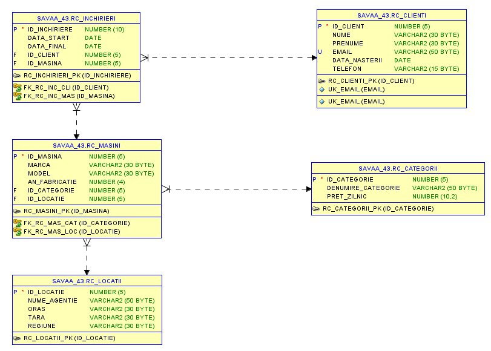

# Car Rental Database (Rent-a-Car)

A relational database project for a multi-region car-rental company, built in **Oracle Database** using **Oracle SQL Developer**. It manages the vehicle fleet, clients, rentals and revenue across agencies in several countries.

> Academic project — table and column names are in Romanian. Comments in the script are in English.

## Overview

The database models the core operations of a rental business:

- **Fleet management** — cars, their category and current location
- **Client records** — personal data and contact details
- **Rental transactions** — linking clients to cars over a date range
- **Revenue & reporting** — daily prices per category, occupancy by location

The schema is normalized up to **Third Normal Form (3NF)**: atomic attributes (1NF), full dependency on the primary key (2NF), and no transitive dependencies (3NF).

## Schema

Five related tables:

| Table | Purpose |
|-------|---------|
| `RC_LOCATII` | Agency locations (country, city, region) |
| `RC_CATEGORII` | Vehicle categories (e.g. SUV, Economy) and daily price |
| `RC_CLIENTI` | Client personal data |
| `RC_MASINI` | Physical car inventory, linked to a category and a location |
| `RC_INCHIRIERI` | Rental transactions linking clients and cars |

Relationships are enforced with **primary keys**, **foreign keys**, a **unique** constraint on client email, and a **check** constraint ensuring the rental end date is on or after the start date.

## What this project demonstrates

- **DDL** — table creation, `ALTER` for structure and constraint changes
- **DML** — `INSERT`, `UPDATE`, `COMMIT`
- **Constraints** — primary/foreign keys, `UNIQUE`, `CHECK`
- **Recovery** — `DROP` and `FLASHBACK TABLE ... TO BEFORE DROP`
- **20+ queries**, including:
  - Single-row functions (dates, strings, numbers)
  - Joins across up to five tables, plus an outer join
  - Group functions with `GROUP BY` / `HAVING`
  - `CASE` and `DECODE` expressions
  - Subqueries (scalar and nested with `IN`)
  - Set operators: `UNION`, `MINUS`, `INTERSECT`
  - A hierarchical query (`CONNECT BY LEVEL`)
- **Other objects** — view, index, sequence, synonym

## How to run

1. Open the script in **Oracle SQL Developer** (or any Oracle client) connected to an Oracle database.
2. Run `rental_database.sql` from top to bottom — it creates the tables, loads sample data, and runs the queries in order.

## Tech stack

Oracle Database · SQL · Oracle SQL Developer

## Author

Sava Alexandru-Ionut — Economic Cybernetics student, ASE Bucharest (CSIE)
